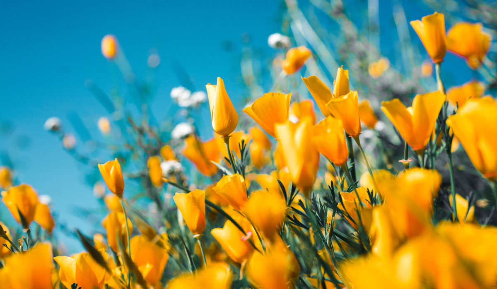
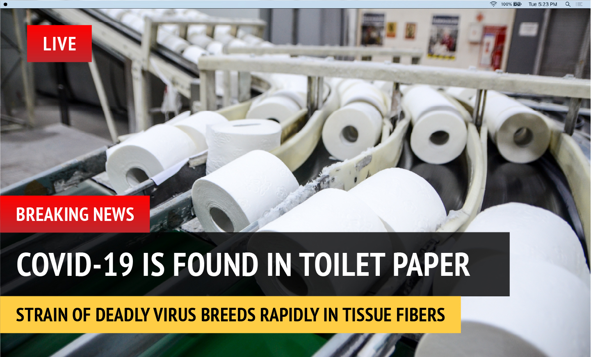

# Image Similarity in Percentage %

## Siamese network to compare image similarity in percentage - based on Keras deep learning model (VGG16, ResNet50) &amp; cosine similarity, euclidean similarity

### Accuracy
The cosine similarity and euclidean similarity are shown in the table.
|image1 | image2| cosine similarity (VGG16) |euclidean similarity (VGG16) | cosine similarity (ResNet50) |euclidean similarity (ResNet50) |
| --- | --- | --- | --- | --- | --- |
|||**84.51%**|0.01326|91.28%|0.05116|
| --- | --- | --- | --- | --- | --- |
|||**63.95%**|0.00980|54.98%|0.02871|
| --- | --- | --- | --- | --- | --- |
|||**100.00%**|1.0|100.00%|1.0|
| --- | --- | --- | --- | --- | --- |
|||**63.66%**|0.01222|78.96%|0.03771|
| --- | --- | --- | --- | --- | --- |
|||**51.74%**|0.01105|51.18%|0.02189|
| --- | --- | --- | --- | --- | --- |
|||**23.80%**|0.00907|30.91%|0.01755|
| --- | --- | --- | --- | --- | --- |
|||**42.68%**|0.01361|49.00%|0.02593|
| --- | --- | --- | --- | --- | --- |
|||**69.20%**|0.01478|70.07%|0.02849|
| --- | --- | --- | --- | --- | --- |
|||**77.01%**|0.02064|82.51%|0.04565|
| --- | --- | --- | --- | --- | --- |
| Original Image| Cropped Image|**93.75%**|0.03695|95.31%|0.07801|
| --- | --- | --- | --- | --- | --- |
| Original Image| Adversarial  Image|**74.47%**|0.01384|90.14%|0.06188|
| --- | --- | --- | --- | --- | --- |
| Original Image| Adversarial  Image|**79.60%**|0.01324|91.45%|0.04503|
| --- | --- | --- | --- | --- | --- |
| Original Image| Screenshot Image |**97.95%**|0.06415|98.69%|0.13120|

## License
- This image similarity model is developed based on Keras deep learning model from https://github.com/fchollet/deep-learning-models
- The ResNet50 weights are ported from the ones [released by Kaiming He](https://github.com/KaimingHe/deep-residual-networks) under the [MIT license](https://github.com/KaimingHe/deep-residual-networks/blob/master/LICENSE).
- The VGG16 and VGG19 weights are ported from the ones [released by VGG at Oxford](http://www.robots.ox.ac.uk/~vgg/research/very_deep/) under the [Creative Commons Attribution License](https://creativecommons.org/licenses/by/4.0/).
- The Inception v3 weights are trained by ourselves and are released under the MIT license.
- Thanks to DAmageNet: A Universal Adversarial Dataset https://arxiv.org/abs/1912.07160


## Citations
```
@inproceedings{Panagiotis2021,
  author = {Panagiotis Kasnesis, Ryan Heartfield, Xing Liang, Lazaros Toumanidis, Georgia Sakellari, Charalampos Patrikakis, George Loukas},
  booktitle = {Journal of Applied Soft Computing},
  title = {Transformer-based identification of stochastic information cascades in social networks using text and image similarity},
  year = {2021}
}
```
